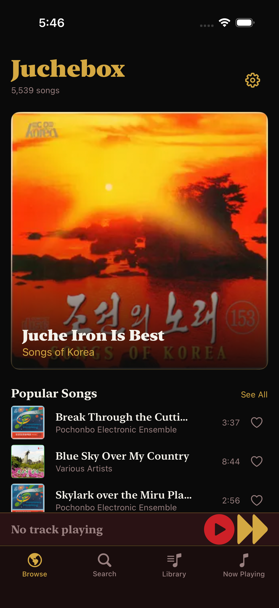
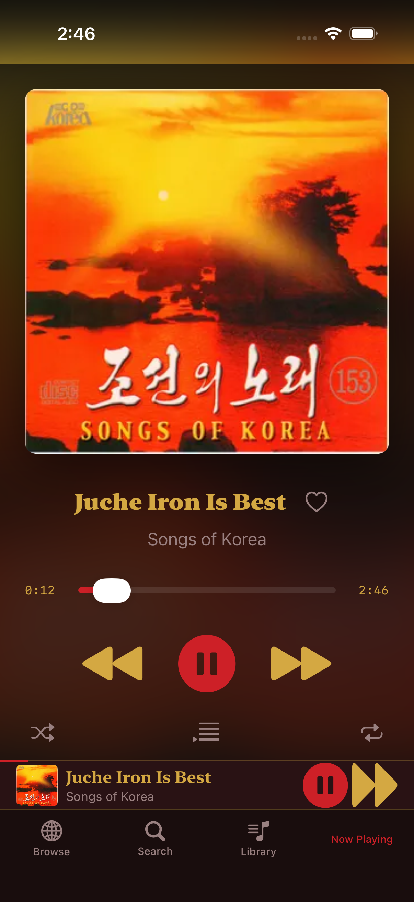
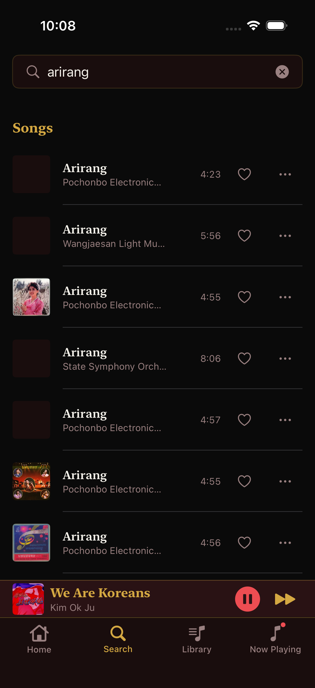
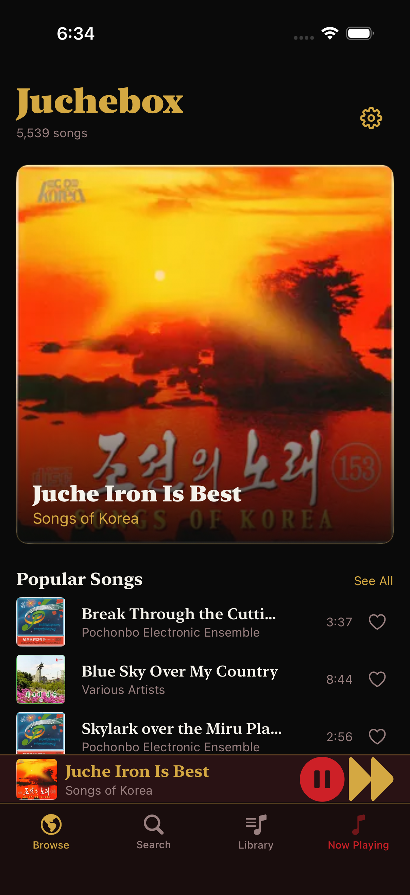
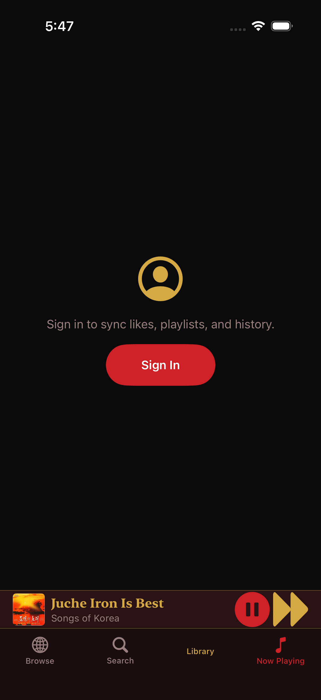

<div align="center">

# Juchebox (주체박스)

**The People's Portal to Juchify.** A native iOS music app for the world's most exclusive catalog.


</div>

---

## What is Juchebox?

Juchebox is a native SwiftUI music app that plays the Juchify streaming service (juchify.com) the way a real music player should. It talks directly to the same public JSON API the Juchify website itself uses. No private endpoints, no scraping, no backend of its own, no WebView.

The full catalog is there: about 5,500 songs, most of them North Korean, streamed through native AVPlayer playback with lock-screen Now Playing, background audio, and Control Center controls. The newest tracks stream as direct MP3 files; everything else plays through the site's own stream-token encrypted HLS flow. The interface is themed as **Chollima Radio (천리마방송)**: Spotify's dark immersive grammar rebuilt in DPRK revolutionary-poster material, in crimson, gold, and coal black.

No telemetry. No analytics. No ads. Zero third-party dependencies.

## ⚠️ Unofficial, third-party client

> **Juchebox is not affiliated with, endorsed by, or connected to Juchify, the Chollima Front, any DPRK institution, or any music rightsholder.** It is not an official client, and it is not a replacement for the Juchify service.
>
> All content streamed by this app remains the property of its owners. Juchebox only ever streams what the public Juchify API already serves; it does not host, copy, download, or redistribute any track.

---

| Browsing | Now Playing | Searching |
|:---:|:---:|:---:|
|  |  |  |
| Popular songs, new releases, hero track | Artwork, scrubber, transport, queue | Live search with recent history |

| Mini Player | Library |
|:---:|:---:|
|  |  |
| Now playing, always one tap away | Sign in to sync likes and history |

---

## Features

### Browsing & Discovery

- **Home feed** straight from the API: a hero track, popular songs, new tracks, new releases, and popular albums, with pull-to-refresh and "See All" sheets for each section.
- **Live catalog count**: the Home header shows the song count reported by the API in real time (about 5,500 at last check).
- **Live search**: search-as-you-type across songs, albums, and artists with debounced requests, pagination, and a tap-through history of recent searches.
- **Album detail**: cover, artist, and the full track list. Play the whole album from the top.
- **Artist detail**: bio, photo, and discography with album links.
- **Play-all**: queue an entire album or result set in one tap.
- **Context menus** on any song row: Play Next, Add to Queue, Go to Album, and Like.
- **Like hearts** on every row and in Now Playing, optimistic and reconciled against the server.

### Playback

- **Native AVPlayer engine** with a real queue: next, previous, shuffle, repeat all, and repeat one.
- **Full-screen Now Playing**: artwork, scrubber with elapsed and remaining time, transport controls, and a queue sheet.
- **Mini-player bar** that stays visible above the tab bar while music plays.
- **Lock screen and Control Center**: play, pause, skip, and seek from anywhere, with real track metadata and artwork.
- **Background audio** so the music keeps playing when you leave the app.
- **Direct MP3 streaming** for the newest catalog entries, with **stream-token encrypted HLS** as the automatic fallback for everything else.
- **Rapid-skip resilience**: if a track is dead server-side, the player retries through the fallback path once, then reports it and advances through the queue instead of freezing.

### Library & Account

- **Optional sign-in** with a Juchify account for liked songs and recently played. Browsing and playback work fine with no account at all.
- **Keychain token storage**: your auth token lives in the iOS Keychain, never in UserDefaults.

### Design & Accessibility

- **Chollima Radio theme**: coal-black `#0A0A0A` canvas, accessible crimson `#EC4D52` (`accentOnDark`) foregrounds, crimson `#CD2027` background fills, gold `#D4A843` headings, serif display type, SF Symbols throughout.
- **English UI**: clean native English interface, with catalog metadata rendered from the API's own EN/KP name maps.
- **Accessible by default**: WCAG 2.1 AA contrast ($\ge 4.5:1$ text, $\ge 3.0:1$ controls), VoiceOver labels on every control, Dynamic Type reflow capped gracefully at accessibility sizes, $\ge 44\text{pt}$ touch targets throughout, and reduced-motion support.
- **Isolated Per-Tab Navigation**: independent `NavigationStack` per tab with scroll position and view state preservation, plus tap-to-pop-to-root on the active tab.

### Privacy

- No analytics, no crash reporting, no advertising SDKs, no telemetry of any kind.
- Zero third-party dependencies: the app is SwiftUI plus Apple frameworks only.
- No downloading, recording, offline caching, or redistribution. Lock metadata on some tracks is shown as an informational badge; the entire public catalog is playable.

## Quick start

**Requirements:** Xcode 16 or newer, and an iOS 17 simulator or device. No package managers, no dependencies to fetch, nothing to install.

```bash
# Build for the simulator
xcodebuild -project Juchebox.xcodeproj -scheme Juchebox \
  -destination 'platform=iOS Simulator,name=iPhone 17' build

# Run the full test suite (84 unit + 7 UI = 91 tests)
xcodebuild test -project Juchebox.xcodeproj -scheme Juchebox \
  -destination 'platform=iOS Simulator,name=iPhone 17'

# Or just open it in Xcode and press Cmd+R
open Juchebox.xcodeproj
```

**Signing for a device:** the project carries no development team, so Xcode will prompt you to pick one on first build. Or pass it on the command line without touching the project: append `DEVELOPMENT_TEAM=<your-team-id>` to the `xcodebuild` invocation above.

**Installing on your iPhone:** Juchebox is not on the App Store. Build from this source and run it on your own device with your own signing, either directly from Xcode or with a standard sideloading tool. A free Apple ID is enough for personal devices; note that free certificates expire, so you will need to re-sign and reinstall periodically.

## Why this exists

The world's most exclusive music catalog deserves a proper native player. Juchify's catalog is served as a web page; Juchebox makes the same catalog feel like a real music app, with lock-screen controls and background audio that a browser tab simply cannot deliver. It is an independent homage, built with respect for the service and its rightsholders: it streams only what the public API already serves, and it never stores a single track.

## License

Juchebox is licensed under the **GNU General Public License v3.0 (GPLv3)**. You may use, study, modify, and share it; any distributed modifications must also be GPLv3 and include the source. See [LICENSE](LICENSE) for the full text.

---

## For developers

This section is for people who want to understand how Juchebox works, extend it, or build something similar against the Juchify API.

### The Juchify API

Base URL `https://juchify.com`, catalog routes through the same `/api/proxy/` reverse proxy the website uses. All catalog reads are public; no account needed.

| Endpoint | Returns |
|---|---|
| `GET /api/proxy/home-fast?lang=en` | Popular albums, new tracks, new releases, popular songs, and the total song count |
| `GET /api/proxy/song/{id}?lang=en` | Full song: title, duration, artist and album names (EN/KP), artwork |
| `GET /api/proxy/album/{id}` | Album plus its full track list |
| `GET /api/proxy/artist/{id}?lang=en` | Artist bio, photo, discography |
| `GET /api/proxy/search?q=...&lang=en&page=N` | Songs, albums, artists, pagination |
| `GET /api/proxy/releases/new?limit=N` | Newly released songs |
| `GET /api/proxy/random-song` | A random song |

Auth is optional and used only for likes and the library: `POST /api/auth/login` with `{username, password}` returns `{token, user}`. The token is sent as an `Authorization: Bearer` header for liked songs, recently played, playlists, and like toggling.

One quirk worth knowing: Home and search results return song stubs without stream URLs. Only the album endpoint exposes them, so Juchebox resolves each stub through its album before playback.

### Architecture

Feature-first layering, deliberately small.

| Layer | Contains |
|---|---|
| **App** | Composition, shared state (`AppState`), theme, translation catalog, accessibility identifiers |
| **Core/API** | Codable models, `JuchifyAPIClient` (URLSession), `CatalogStore` |
| **Core/Auth** | `AuthStore` (Keychain token provider) |
| **Core/Player** | Player state types and the engine protocol |
| **Features** | Catalog, Library, Settings, Onboarding, Player views |
| **Resources** | Info.plist, assets |

All state flows through `AppState` on the main actor. Views stay thin; logic lives in stores. `JuchifyAPIClient` is a thin URLSession wrapper with JSON decoding, server error mapping, and an optional Bearer token closure. The player engine publishes `PlayerState` and mirrors it to `MPNowPlayingInfoCenter` and `MPRemoteCommandCenter`.

### Streaming

Juchebox mirrors the website's own player, honestly and without touching anything protected:

- **Direct MP3**: newest tracks stream straight from the public uploads path, no auth, no token.
- **Stream-token encrypted HLS**: the rest of the catalog, including older tracks whose raw files no longer exist, streams through the site's encrypted-HLS flow. The app mints the same stream token from the same public endpoint the website's player uses, and presents the same browser-compatible request headers on key and segment requests. No encryption is stripped, no keys are extracted, and segments are never written to disk.
- **Playback resilience**: the player tries the direct MP3, retries once through the stream-token HLS path, then surfaces a "stream unavailable" state and auto-advances through the queue.

### Key design decisions

- **Native over WebView**: WebKit-owned audio dies on page navigation, and lock-screen Now Playing requires AVPlayer-owned audio. A native client was the only way to get real playback.
- **Public surface only**: the app uses exactly the `/api/proxy/` endpoints the Juchify website itself uses. No private endpoints, no scraping.
- **MP3 first, HLS fallback**: direct MP3 for speed, stream-token HLS for full-catalog coverage, auto-advance for dead tracks.
- **Keychain auth**: the token lives in the iOS Keychain, never in UserDefaults.
- **Zero dependencies**: reproducible builds and an easy privacy audit.
- **Custom tab bar**: a bespoke `ChollimaTabBar` instead of SwiftUI's system `TabView`, which hits an iOS 26 rendering bug with bottom safe-area content.
